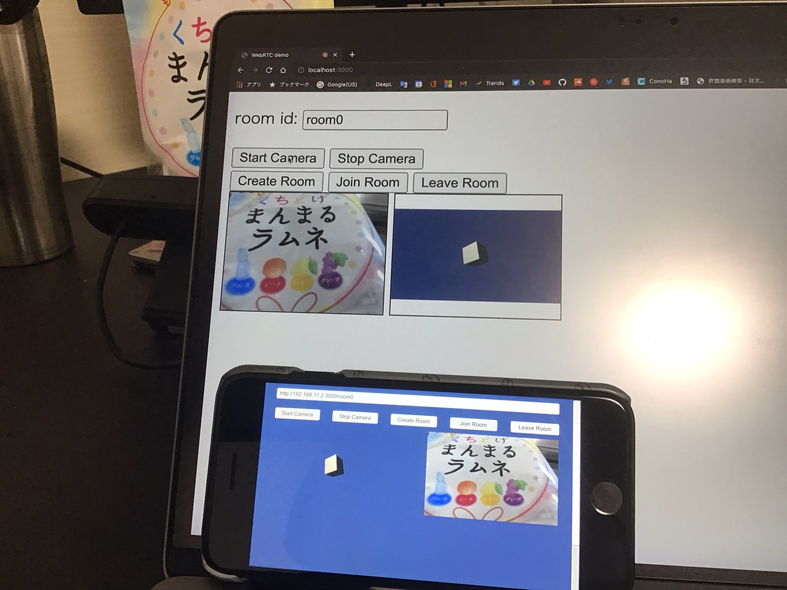

# WebRTC Demo

WebRTCを理解するために作った簡単なデモプログラムです。
2つのウィンドウ間で映像を双方向に通信できます。



# 使い方

1. Node.jsをインストールし、以下のコマンドを実行する

```bash
node signaling.js
```

2. [http://localhost:3000/](http://localhost:3000/) を2つ開く
3. 片方のページで `Start Camera` > `Create Room` の順でボタンを押す
4. もう片方のページで `Start Camera` > `Join Room` の順でボタンを押す

# Unityで動かす

`unity/WebRTCDemo/Assets/Scenes/WebRTCDemo.unity` を起動するとUnity版のWebRTC Demoを動かすことができます。

# 参考

- [手動でWebRTCの通信をつなげよう ーWebRTC入門2016](https://html5experts.jp/mganeko/19814/)
- [WebRTC for Unity](https://docs.unity3d.com/Packages/com.unity.webrtc@2.3/manual/index.html)

